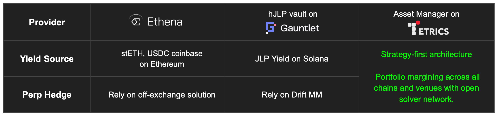

# Overview

Execute any type of strategy into on-chain transaction based on specific strategy intents.\
TETRICS's [adopter framework ](../../architecture/adapter-framework.md)enables asset manager to do everything, such as complex trading strategies, vault operation, staking/yield farming management with just a few lines of code.

### Benefit for building strategy on TETRICS

TETRICS focus on Strategy-first architecture.

1. **Better Capital Efficiency:**\
   Portfolio margining across all chains and venues with open solver network.
2. **Atomic Consolidation:**\
   Same-time execution of all legs, Minimize slippage, gas fees.
3. **Privacy Preserving:**\
   Protect strategy privacy while maintaining verifiable on-chain transparency.

## Strategy Example

### 1. Delta Neutral Strategy with perps

<figure><figcaption></figcaption></figure>

### 2. Stablecoin High-Yield Strategy with options

<figure><figcaption>
*30,Mar,25 Data from <a href="https://defillama.com/yields?project=All">Defilama</a>
</figcaption></figure>
